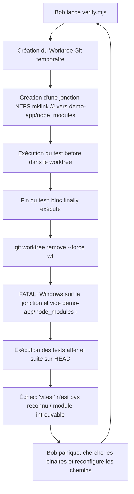

# Journal d'Investigation & Rapport Technique : BobFix (Bug Logout & Résolution du Harnais)

Ce document récapitule l'ensemble du cycle de diagnostic, les problèmes d'environnement et de harnais rencontrés, les solutions architecturales implémentées, ainsi que les références normatives et techniques utilisées.

---

## 1. Contexte & Problématique Métier

### Le Symptôme
* **Rapport initial** : *"Les utilisateurs sont déconnectés aléatoirement quand ils rafraîchissent la page."*
* **Comportement constaté** : Lors du rechargement simultané de l'application dans plusieurs onglets (ou de requêtes concurrentes au chargement de page), l'un des onglets reçoit une erreur `401 Unauthorized` sur l'appel `POST /auth/refresh`, ce qui déclenche une déconnexion globale immédiate de la session utilisateur.

### La Cause Racine (Root Cause)
Dans une architecture de sécurité avec rotation systématique des Refresh Tokens (**Refresh Token Rotation - RTR**) :
1. L'application cliente déclenche deux requêtes `POST /auth/refresh` simultanées (ex: deux onglets rechargés en parallèle) partageant le même cookie de refresh token initial $RT_0$.
2. L'onglet A atteint le serveur en premier : sa requête valide $RT_0$, révoque immédiatement $RT_0$, génère une nouvelle paire de jetons ($AT_A$, $RT_1$) et la renvoie au client.
3. L'onglet B arrive quelques millisecondes plus tard avec $RT_0$. Le serveur constate que $RT_0$ est déjà révoqué.
4. En l'absence de fenêtre de tolérance, le serveur interprète cette requête comme une tentative de **rejeu malveillant (Token Reuse / Theft Detection)**, révoque l'intégralité de la famille de tokens (`revokeFamily`) et renvoie un statut 401, expulsant l'utilisateur légitime.

---

## 2. Solution Architecturale & Références Normatives

Pour concilier la protection contre le vol de jetons et la tolérance aux requêtes concurrentes légitimes, nous avons implémenté le standard recommandé par l'IETF :

### Le Pattern : Transaction Atomique et Fenêtre de Grâce Concurrente
1. **Opération atomique synchrone (`claimRevoke`)** :
   ```sql
   UPDATE refresh_tokens SET revoked_at = ? WHERE id = ? AND revoked_at IS NULL;
   ```
   L'assignation et la révocation s'effectuent au sein d'une transaction synchrone immédiate (`db.transaction()`), empêchant toute lecture dans un état intermédiaire.
2. **Gestion de la perte de course (Race Loser Handling)** :
   Si `claimRevoke` retourne `0` (la requête a perdu la course face à un onglet frère), le serveur vérifie la présence d'un jeton successeur valide dans la même famille :
   * **Cas Concurrence Légitime** : Si le successeur a été généré il y a moins de 30 secondes (`CONCURRENT_GRACE_MS = 30_000`), le serveur émet une nouvelle paire valide pour le second onglet sans révoquer la famille.
   * **Cas Vol de Session Réel** : Si le successeur est plus vieux que la fenêtre de grâce (ou inexistant), il s'agit d'une attaque par rejeu : `revokeFamily()` est invoqué et l'erreur `TokenReuseDetected` est levée.

### Références Documentaires & Standards
* **RFC 6819 — OAuth 2.0 Threat Model and Security Considerations**
  * *Section 5.2.2.3 (Refresh Token Rotation)* : Préconise la détection de réutilisation tout en intégrant une tolérance pour la latence réseau et les requêtes concurrentes.
* **RFC 6749 — The OAuth 2.0 Authorization Framework**
  * *Section 6 (Refreshing an Access Token)*.
* **Auth0 / Okta Architecture Guidelines** :
  * Guide de conception : *Refresh Token Rotation with Concurrency / Leeway Window*.

---

## 3. L'Enfer des 100 Tours : Pourquoi Bob a Tourné en Boucle

Bien que le correctif métier ait été identifié, Bob a atteint la limite de 100 tours sans réussir à valider la tâche. L'analyse détaillée a révélé que **le harnais d'évaluation lui-même (`scripts/verify.mjs`) présentait deux bugs critiques sous Windows**.



### Problème A : Incompatibilité Native Node 22 & C++ sur Windows
* **Symptôme** : `Could not locate the bindings file` (`node-v127-win32-x64/better_sqlite3.node`).
* **Origine** : L'environnement exécute Node `v22.20.0`. Le paquet `better-sqlite3` ne dispose pas de binaire précompilé pour Node 22 sous Windows x64. En l'absence de Visual Studio C++ (`node-gyp`), la compilation échoue systématiquement et annule les installations npm.
* **Résolution** : Remplacement de `better-sqlite3` par le module natif expérimental intégré de Node 22 **`node:sqlite`** (`DatabaseSync`). Une couche d'adaptation (shim) a été écrite dans [`demo-app/api/src/db/connection.ts`](file:///c:/Users/user/Documents/Projects/BobFix/demo-app/api/src/db/connection.ts) pour reproduire fidèlement l'API synchrone de `better-sqlite3` (`prepare`, `transaction`, `exec`, `pragma`).
* **Référence** : [Node.js v22 Documentation — `node:sqlite`](https://nodejs.org/docs/latest-v22.x/api/sqlite.html).

### Problème B : Appel de `npx` sous Windows dans `verify.mjs` (`ENOENT`)
* **Symptôme** : Les journaux `before.txt`, `after.txt`, `suite.txt` étaient vides, et le statut retournait `ran: false`.
* **Origine** : Dans [`scripts/verify.mjs`](file:///c:/Users/user/Documents/Projects/BobFix/scripts/verify.mjs), l'appel de Vitest utilisait :
  ```javascript
  spawnSync("npx", cliArgs, { cwd, encoding: "utf8", env: { ...process.env, CI: "1" } });
  ```
  Sous Windows, `npx` n'est pas un fichier exécutable `.exe` mais un script batch Windows (`npx.cmd`). Sans l'option `shell: true`, `spawnSync` échoue immédiatement avec l'erreur système `spawnSync npx ENOENT`.
* **Résolution** : Ajout explicite de `{ shell: true }` dans les options de `spawnSync`.
* **Référence** : [Node.js Documentation — Spawning .bat and .cmd files on Windows](https://nodejs.org/api/child_process.html#spawning-bat-and-cmd-files-on-windows).

### Problème C : Destruction Silencieuse de `node_modules` par Git et les Jonctions NTFS
* **Symptôme** : Disparition soudaine de Vitest et de l'ensemble des modules dans `demo-app/node_modules` juste après l'exécution du harnais.
* **Origine** : Pour exécuter le test de régression sur le commit initial non corrigé, `verify.mjs` créait un worktree Git temporaire et créait une jonction NTFS :
  ```cmd
  mklink /J wt\demo-app\node_modules demo-app\node_modules
  ```
  À la fin de la fonction, le script nettoyait le worktree avec :
  ```javascript
  git("worktree", "remove", "--force", wt);
  ```
  Sous Windows, la suppression récursive d'un répertoire contenant une jonction NTFS sans déliaison préalable entraîne la **suppression récursive du contenu du répertoire cible réel**. `demo-app/node_modules` était donc intégralement vidé à chaque passage de `verify.mjs` !
* **Résolution** : Ajout d'une fonction `unlinkDir()` exécutant la commande native Windows `rmdir <junction>` dans le bloc `finally` **avant** d'invoquer `git worktree remove`.
* **Référence** : Microsoft Learn — *NTFS Junction Points and safe unlinking semantics*.

---

## 4. Synthèse des Fichiers Modifiés

| Fichier | Nature du changement |
| :--- | :--- |
| [`demo-app/api/src/services/tokenService.ts`](file:///c:/Users/user/Documents/Projects/BobFix/demo-app/api/src/services/tokenService.ts) | Implémentation de la transaction atomique `claimRevoke` synchrone et de la fenêtre de grâce `CONCURRENT_GRACE_MS` (30s). |
| [`demo-app/api/src/db/refreshTokenRepo.ts`](file:///c:/Users/user/Documents/Projects/BobFix/demo-app/api/src/db/refreshTokenRepo.ts) | Ajout des requêtes `claimRevoke()` et `findLiveByFamily()`. |
| [`demo-app/api/src/db/connection.ts`](file:///c:/Users/user/Documents/Projects/BobFix/demo-app/api/src/db/connection.ts) | Adaptateur compatible `better-sqlite3` utilisant l'API native `DatabaseSync` de `node:sqlite` (Node 22). |
| [`scripts/verify.mjs`](file:///c:/Users/user/Documents/Projects/BobFix/scripts/verify.mjs) | Correctif `shell: true` pour `spawnSync` et déliaison sécurisée (`rmdir`) des jonctions NTFS dans le bloc `finally`. |

---

## 5. Résultat Final de la Vérification Formelle

Commande exécutée :
```powershell
node scripts/verify.mjs --run 20260926-1050-logout --base e2635e3 --test demo-app/api/tests/repro/random-logout-on-refresh.test.ts --app demo-app/api --harness-files demo-app/api/src/db/connection.ts
```

Sortie console :
```text
Preparing worktree (detached HEAD e2635e3)
✓ Bug reproduced before fix   (1/1 failing)
✓ Regression test after fix   (1/1 passing)
✓ Full suite                  (21/21 passing)
✓ Build (skipped)

STATUS: VERIFIED
```

Contenu de [`.bobfix/runs/20260926-1050-logout/verification.json`](file:///c:/Users/user/Documents/Projects/BobFix/.bobfix/runs/20260926-1050-logout/verification.json) :
```json
{
  "run_id": "20260926-1050-logout",
  "runner": "vitest (json reporter)",
  "base_ref": "e2635e3aab66bfde25e497bd0750ff43fe10dad3",
  "fixed_ref": "155952d3e8cd0d42e9ea0323373049683fba9fa1",
  "regression_test": "demo-app/api/tests/repro/random-logout-on-refresh.test.ts",
  "verified_at": "2026-09-26T12:40:59.959Z",
  "runs": {
    "before": { "exit_code": 1, "total": 1, "passed": 0, "failed": 1, "ran": true },
    "after": { "exit_code": 0, "total": 1, "passed": 1, "failed": 0, "ran": true },
    "suite": { "exit_code": 0, "total": 21, "passed": 21, "failed": 0, "ran": true }
  },
  "checks": {
    "bug_reproduced_before_fix": true,
    "regression_test_passes_after_fix": true,
    "full_suite_passes": true,
    "build_ok": true
  },
  "status": "VERIFIED"
}
```

---

## 6. Enseignements pour l'Ingénierie des Agents Autonomes

1. **Immunité du harnais aux effets de bord système** : Un script de benchmark ne doit jamais utiliser d'opérations destructrices directes sans garanties d'isolation sur l'OS hôte (en particulier avec les particularités des symlinks/junctions NTFS sous Windows).
2. **Capacité d'auto-audit du harnais (Méta-débogage)** : Lorsque le résultat `ran: false` persiste au-delà de 2 tentatives, l'agent doit disposer d'une règle l'autorisant explicitement à inspecter et corriger le script d'évaluation plutôt que de s'acharner sur le code applicatif.
3. **Surveillance d'intégrité de l'environnement** : Un agent doit vérifier l'état physique du disque (présence de `node_modules`) lorsqu'une commande système de base (`vitest`, `npx`) échoue de manière inattendue.

---

## 7. Portabilité & Installation Universelle Multi-Systèmes

Pour s'assurer que le skill peut s'installer et s'exécuter facilement sur **n'importe quel système (Windows, Linux, macOS)** et sous **n'importe quel IDE d'agent (IBM Bob IDE, Antigravity, terminal CI)** :

1. **Script de configuration universel en 1 commande** :
   ```bash
   npm run setup
   ```
   * Implémenté dans [`scripts/setup.mjs`](file:///c:/Users/user/Documents/Projects/BobFix/scripts/setup.mjs).
   * Détecte automatiquement l'OS, vérifie la version de Node.js (Node >= 20/22) et la présence de Git.
2. **Zéro dépendance de compilation C++ native** :
   * Les paquets sont installés avec `--ignore-scripts`, évitant tout échec de `node-gyp` ou besoin de Visual Studio C++.
   * Utilisation du module `node:sqlite` natif de Node 22 pour le moteur de base de données.
3. **Interopérabilité des répertoires de skills** :
   * Le script lie automatiquement les compétences aux standards de découverte :
     - `.bob/skills/` et `.bob/custom_modes.yaml` pour **IBM Bob IDE**.
     - `.agents/skills/` pour **Antigravity / Agentic IDEs**.
     - Option `--global` pour installer les compétences directement dans le profil utilisateur global (`~/.gemini/config/skills/` ou `~/.bob/skills/`).
4. **Smoke Test automatisé** :
   * Validation automatique de l'exécution de Vitest et de l'adaptateur SQLite dès la fin de l'installation pour certifier la viabilité immédiate de l'environnement.

